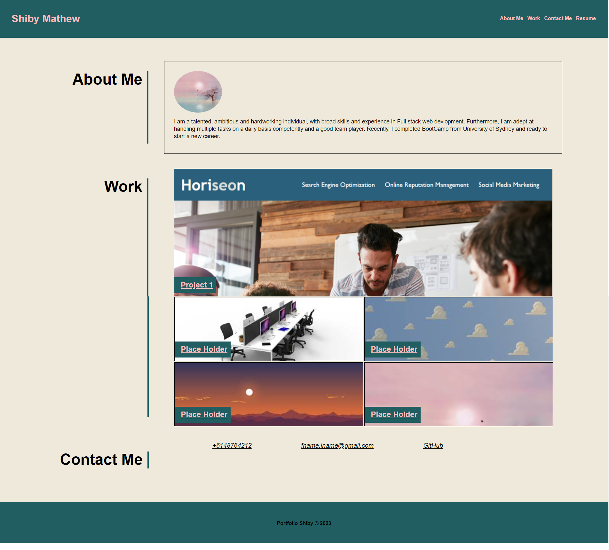

# Shiby-Portfolio

```
The link for my deployed wesite can viewed here


```

## Description

```
A portfolio of work can showcase my skills and talents to employers looking to fill a part-time or full-time position. An effective portfolio highlights the strongest work as well as the thought processes behind it. Here I used placeholder images and names. Later I will change them to real applications as I create them during the course.

```

## User Story

```
AS AN employer
I WANT to view a potential employee's deployed portfolio of work samples
SO THAT I can review samples of their work and assess whether they're a good candidate for an open position
```

## Acceptance Criteria

```
GIVEN I need to sample a potential employee's previous work
WHEN I load their portfolio
THEN I am presented with the developer's name, a recent photo or avatar, and links to sections about them, their work, and how to contact them
WHEN I click one of the links in the navigation
THEN the UI scrolls to the corresponding section
WHEN I click on the link to the section about their work
THEN the UI scrolls to a section with titled images of the developer's applications
WHEN I am presented with the developer's first application
THEN that application's image should be larger in size than the others
WHEN I click on the images of the applications
THEN I am taken to that deployed application
WHEN I resize the page or view the site on various screens and devices
THEN I am presented with a responsive layout that adapts to my viewport
```

## Getting Started

```

I have changed the title element and added more semantic elements rather than divs.
I have checked all the links are working and fixed
I have added alt attribute to all img tags.
Created some new classes for CSS file and added those in HTML page.
Rearranged the CSS file to remove duplications.

```

## Code Snippet


## Mock-Up

The following image shows the web application's appearance and functionality:


